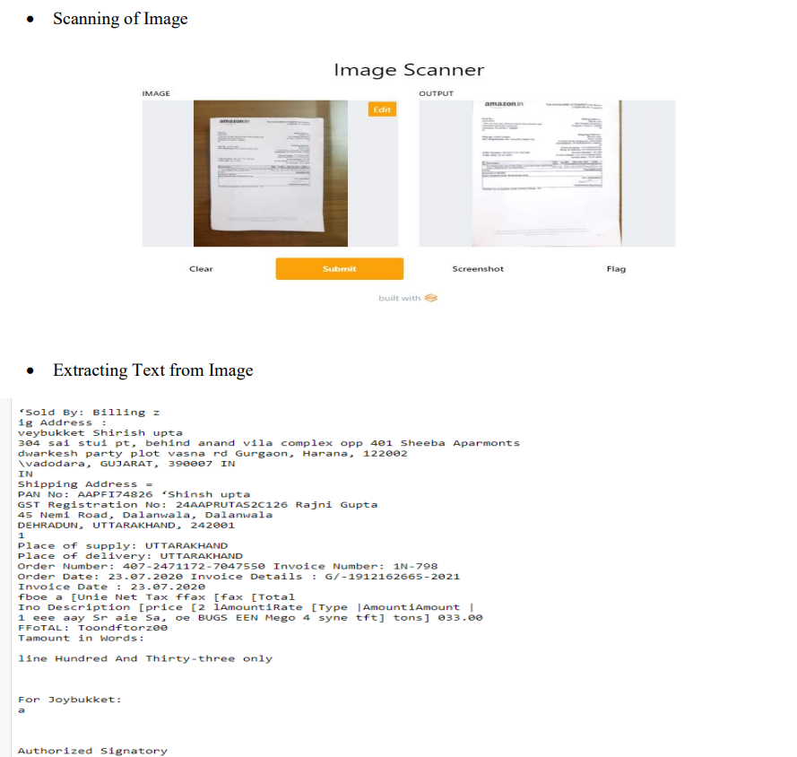
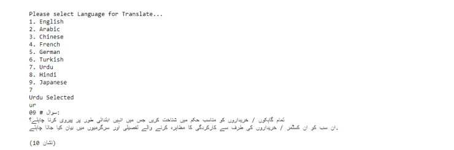
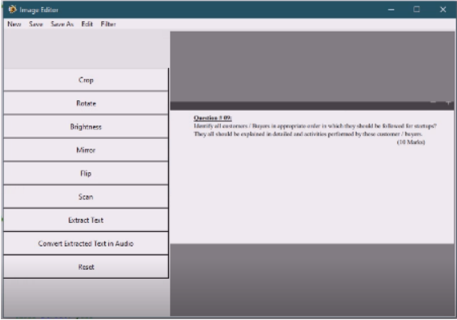

# Image-Processing-Python-Application

## Project Name: Image Processing Software with Text Extraction and Multilingual Translation

### Project Description:
The Image Processing Software is a powerful tool designed to process images and perform various operations such as text extraction, translation into multiple languages, cropping, editing, rotation, tilting, resizing, and applying filters. The software provides a user-friendly interface that allows users to manipulate their images and extract text from them effortlessly.

### OUTPUT

 

 

 
### Key Features:

### Image Text Extraction:
The software utilizes Optical Character Recognition (OCR) technology to extract text from images. Users can select an image and extract the text contained within it accurately and efficiently.

### Multilingual Translation:
After extracting the text from the image, the software offers a multilingual translation feature. Users can choose from a wide range of languages, including English, Chinese, Urdu, Arabic, and French, to translate the extracted text. This functionality enables easy communication and understanding across different language barriers.

### Image Editing:
The software provides a comprehensive set of image editing tools. Users can crop images to remove unwanted areas, rotate or tilt images to adjust their orientation, resize images to specific dimensions, and apply various filters to enhance the visual quality of the image. These editing features allow users to customize and improve their images according to their preferences.

### User-Friendly Interface:
The software is designed with a user-friendly interface that simplifies the image processing workflow. Users can easily select images, perform desired operations, extract text, translate it, and edit images with intuitive controls and options. The interface provides a seamless experience, even for users with limited technical expertise.

### Advanced Image Processing Algorithms:
The software employs advanced image processing algorithms to ensure high-quality results. It utilizes algorithms for text recognition, language translation, image manipulation, and filtering, delivering accurate and visually appealing outcomes.

### File Format Compatibility:
The software supports various image file formats, including JPEG, PNG, GIF, and BMP. Users can import images in their preferred format, process them, and save the modified images in the desired format without any loss of quality.

## Technologies Used:

Programming Language: The software is developed using a programming language suitable for image processing, such as Python.
OCR Library: An OCR library is integrated into the software to perform accurate text extraction from images.
Image Processing Libraries: Libraries like OpenCV or PIL (Python Imaging Library) are utilized for image manipulation, editing, and applying filters.
Translation APIs: Integration with translation APIs, such as Google Translate, enables the multilingual translation functionality.
User Interface Framework: A suitable user interface framework, such as PyQt and Tkinter is employed to create an interactive and user-friendly interface.
The Image Processing Software with Text Extraction and Multilingual Translation capabilities provides users with a comprehensive toolset to process, edit, and enhance their images while extracting and translating text from images seamlessly. Whether it's for personal or professional use, this software simplifies image manipulation tasks and fosters efficient communication across different languages.
